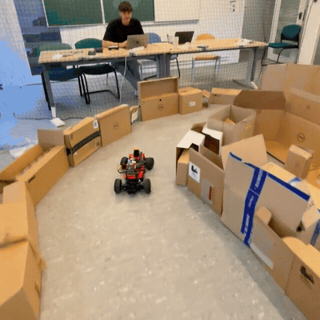
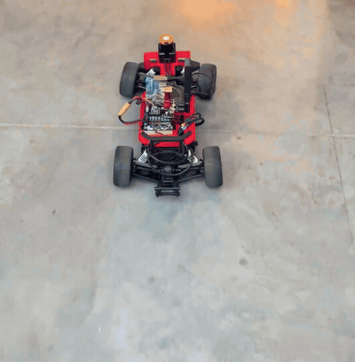
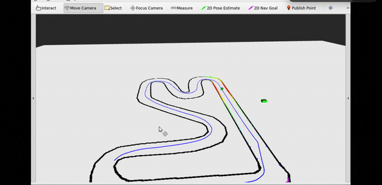
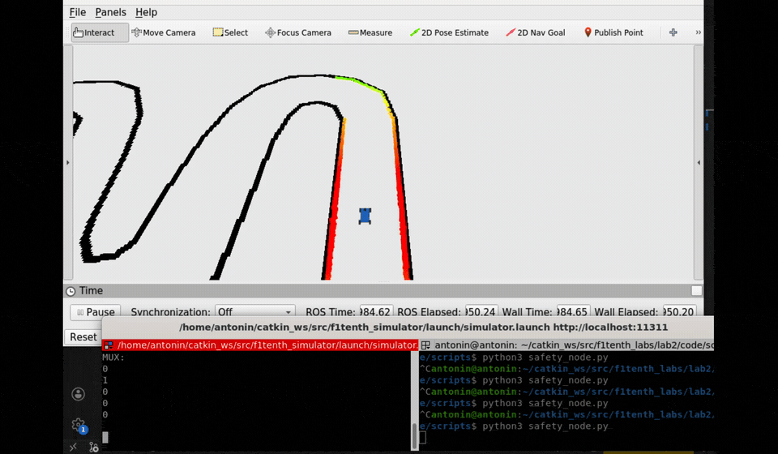

# F1TENTH Autonomous Racing

Wall following, gap following, pure pursuit and emergency braking on a 1/10-scale
autonomous race car. Robotics course at École Polytechnique, 2026 — ROS 1, Python.

> **Scope and attribution.** The lab skeletons, handouts and simulator come from
> [f1tenth/f1tenth_labs](https://github.com/f1tenth/f1tenth_labs) (F1TENTH, UPenn).
> This repository contains **only the code I wrote**. Files I did not modify are not
> included — which is also why this is not buildable as a ROS package. It is meant to
> be read, not installed.

## Gap follow with disparity extension — `gap_follow/`

Shown above, on the cardboard track. Fully reactive: no map, no localisation, no memory
between scans.

- Preprocessing: NaN and inf mapped to 10 m, ranges capped at 3 m.
- **Disparity extension.** Wherever two consecutive range readings differ by more than
  0.30 m, the nearer obstacle is widened by half the car width (0.50 m). Without this
  the car clips the inside of corners: it steers toward the gap it *sees* rather than
  the gap it can physically fit through.
- Steering smoothed across frames, which removes the oscillation that appears at speed.

## Wall following — `wall_follow/`

Two LiDAR beams, at −90° and at −90° + 42°, give the angle of the wall relative to the
car. From those, the perpendicular distance and — projecting one metre ahead — the
distance the car *will* have if it holds its current heading. A PID controller
(kp = 15, kd = 0.1) drives that predicted distance to a 0.9 m setpoint.

Projecting ahead rather than correcting on the current distance is what stops the car
oscillating along the wall: by the time the present error is measured, it is already
out of date.

Speed is scheduled on steering angle — 1.5 m/s below 10°, 1.0 m/s up to 20°, 0.5 m/s
beyond — so the car slows itself into corners instead of understeering through them.

## Pure pursuit — `pure_pursuit/`

Follows a racing line recorded beforehand by driving the car manually around the track.

- Waypoints are transformed into the car frame rather than tracked in the map frame,
  which reduces each control step to a single arc computation.
- Lookahead 1.2 m, wheelbase 0.33 m, steering clamped at 0.4 rad.
- Publishes the target point and the full line as RViz markers. Most of the tuning was
  done by watching the lookahead point move rather than by reading numbers.

The colours in the clip are the recorded line; the car is the marker tracking along it.

## Emergency braking — `safety/`

Time-to-collision computed from the LiDAR scan and the odometry, braking below a fixed
threshold. Runs underneath every other controller and overrides them. The terminal in
the clip shows the trigger firing as the car closes on the wall.

## Limitations

- **No online replanning.** The car is either purely reactive (wall follow, gap follow)
  or follows a fixed pre-recorded line (pure pursuit). It cannot route around an
  obstacle that was not there when the line was logged — the RRT lab was not completed.
- Pure pursuit uses a single lookahead distance for the whole track, so it understeers
  in tight corners and stays conservative on the straights. A speed-dependent lookahead
  is the obvious next step.
- Gap follow caps ranges at 3 m, so it commits to a gap late. It works at the speeds
  shown here and would need a longer horizon beyond them.
- The wall follower only follows the right-hand wall. There is no logic to pick a side,
  so it cannot handle a track that opens out on that side.

## Layout

    gap_follow/     reactive planner
    wall_follow/    PID wall follower
    pure_pursuit/   path follower
    safety/         emergency braking
    docs/           project presentation (in French)
    media/          clips — GIFs above, full videos as .mp4

## Credits

Lab skeletons, simulator and course material:
[f1tenth/f1tenth_labs](https://github.com/f1tenth/f1tenth_labs), MIT licence.
